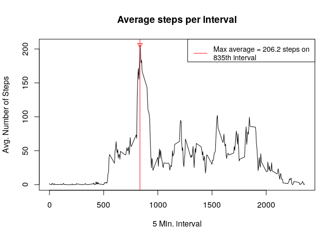
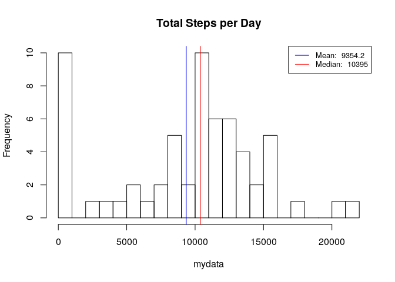
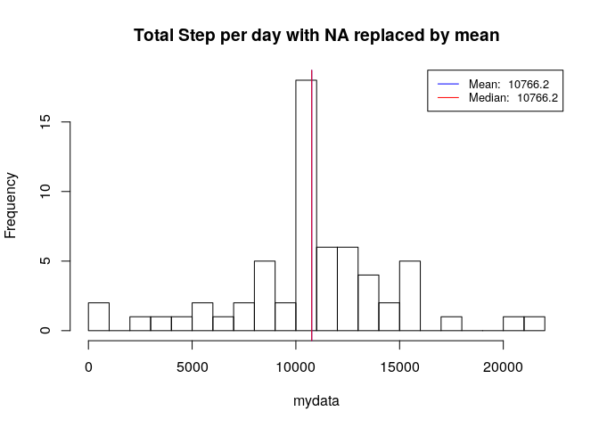
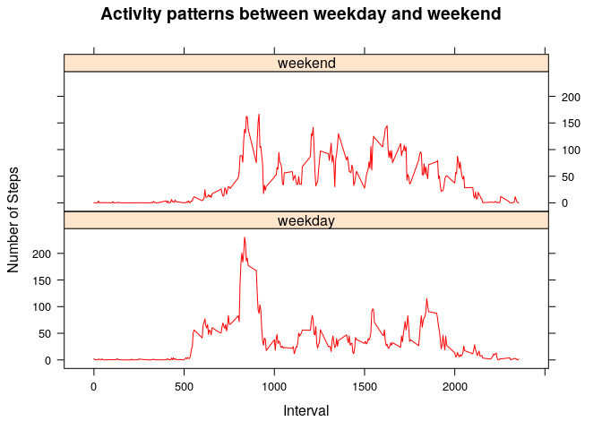

# Reproducible Research: Peer Assessment 1


## Loading and preprocessing the data
First we are going to setup our working environment, load the needed library, working directory, check if the datafile is already present and if not just download the data from the course website

```r
#removes all variables from environment
rm(list=ls(all=TRUE)) 
# load library we are going to use
library(data.table)
library(lattice)
# set the working directory
setwd("/home/gbartolotta/Coursera/Reproducible_Data/RepData_PeerAssessment1/")
filename <- "activity.csv"
zipFilename <- "activity.zip"
# check if the csv file is in the folder if exists download it 
# if not download from internet
if(!file.exists(filename)){
        if(!file.exists(zipFilename)){
                download.file("https://d396qusza40orc.cloudfront.net/repdata%2Fdata%2Factivity.zip", zipFilename, method = "curl")
        }
        unzip(zipFilename)
}
```
Then I read the file and inspect the structure

```r
# read the csv
activity <- read.csv(filename, header = T)
names(activity)
```

```
## [1] "steps"    "date"     "interval"
```

```r
str(activity)
```

```
## 'data.frame':	17568 obs. of  3 variables:
##  $ steps   : int  NA NA NA NA NA NA NA NA NA NA ...
##  $ date    : Factor w/ 61 levels "2012-10-01","2012-10-02",..: 1 1 1 1 1 1 1 1 1 1 ...
##  $ interval: int  0 5 10 15 20 25 30 35 40 45 ...
```

```r
head(activity)
```

```
##   steps       date interval
## 1    NA 2012-10-01        0
## 2    NA 2012-10-01        5
## 3    NA 2012-10-01       10
## 4    NA 2012-10-01       15
## 5    NA 2012-10-01       20
## 6    NA 2012-10-01       25
```
I have also created a function to plots the histogram

```r
create_hist <- function(mydata, title){
        hist(mydata, main = title, breaks = 24)
        mean_val <- round(mean(mydata), 1)
        mean_val
        median_val <- round(median(mydata), 1)
        median_val
        abline(v=mean_val, lwd = 1, col = 'blue')
        abline(v=median_val, lwd = 1, col = 'red')
        legend('topright', lty = 1, lwd = 1, col = c("blue", "red"),
               cex = .8, 
               legend = c(paste('Mean: ', mean_val),
                          paste('Median: ', median_val))
        )        
}
```
## What is mean total number of steps taken per day?
To calculate the mean total number of steps per day I create a dataframe with the sum of steps grouped by day, and print the mean and the median

```r
# Convert csv in data table and Take the total amount of steps per day
dt <- data.table(activity)
dt_sum <- dt[, list(totalSteps = sum(steps, na.rm = TRUE)), by = date]
paste('Mean: ', round(mean(dt_sum$totalSteps),1))
```

```
## [1] "Mean:  9354.2"
```

```r
paste('Median: ', round(median(dt_sum$totalSteps),1))
```

```
## [1] "Median:  10395"
```


## What is the average daily activity pattern?
Here I start aggregating the activity data and calculate the mean on steps value grouped by interval.
Then I plot the results.

```r
dt_by_interval <- dt[, list(avg_steps = mean(steps, na.rm = TRUE)), by = interval]

# plot 
plot(avg_steps~interval, data=dt_by_interval, type="l", xlab = "5 Min. interval", ylab = "Avg. Number of Steps", main ="Average steps per interval")

max_v <- dt_by_interval[which.max(dt_by_interval$avg_steps),]
# draw the line with the max val
abline(v=max_v$interval, lwd = 1, col = 'red')
points(max_v$interval,  max_v$avg_steps, col = 'red', lwd = 1, pch = 6)
legend('topright', lty = 1, lwd = 1, col = c("red"),
       cex = .9, 
       legend = c(paste('Max average = ', round(max_v$avg_steps, 1), ' steps on \n', max_v$interval, 'th interval', sep = ""))
)        
```

<!-- -->


## Imputing missing values
My strategy to input the missing result:

- Start checking how many records have NA values

```r
missing <- sum(is.na(activity$steps))
missing
```

```
## [1] 2304
```
- Join the datatable created earlier that summarizes the average number of steps per interval to the original dataset

```r
setkey(dt, interval)
setkey(dt_by_interval, interval)

dt_missing <- dt[dt_by_interval]
```
- Then I will fill the missing values with the average over 5 minutes using a function that replace the value with the average if the corresponding value is NA

```r
fillValues <- function(x, y) {
        v <- if(is.na(x)) y else x
        return(v)
}

# add a column new_steps with the new steps value
dt_missing$new_steps <- mapply(fillValues, dt_missing$steps, dt_missing$avg_steps)

# calculate the sum of steps per day
dt_missing_summary <- dt_missing[, list(new_steps = sum(new_steps, na.rm = TRUE)), by = date]
paste('Mean: ', round(mean(dt_missing_summary$new_steps),1))
```

```
## [1] "Mean:  10766.2"
```

```r
paste('Median: ', round(median(dt_missing_summary$new_steps),1))
```

```
## [1] "Median:  10766.2"
```
- Finally I plot the results

```r
create_hist(dt_sum$totalSteps, title = "Total Steps per Day")
```

<!-- -->

```r
create_hist(dt_missing_summary$new_steps, title = "Total Step per day with NA replaced by mean")
```

<!-- -->

We can see that after replacing the NA value with the mean per interval, the total mean value get closer to the median value.

## Are there differences in activity patterns between weekdays and weekends?
To analyze the differences in activity patterns between weekdays and weekends let's start creating a function that evaluate the date and extract the daytype as weekand or weekday

```r
weekpart <- function(d){
        part <- if(weekdays(d) %in% c("Saturday", "Sunday")) "weekend" else "weekday"
        return(part)
}
```

Then I apply the function to the dataset adding a new column with the corresponding value

```r
dt_missing$daytype = as.factor(sapply(as.Date(dt_missing$date), FUN=weekpart))
```

Finally summarize the dataset and print the graph

```r
dt_missing_summary = dt_missing[, list(avg_steps = mean(new_steps)), by = list(interval, daytype)]
xyplot(avg_steps~interval | daytype, data = dt_missing_summary,
       type = 'l',
       xlab = 'Interval',
       ylab = 'Number of Steps',
       main = "Activity patterns between weekday and weekend",
       col = c("red"),
       lwd = 1,
       layout = c(1,2))
```

<!-- -->
